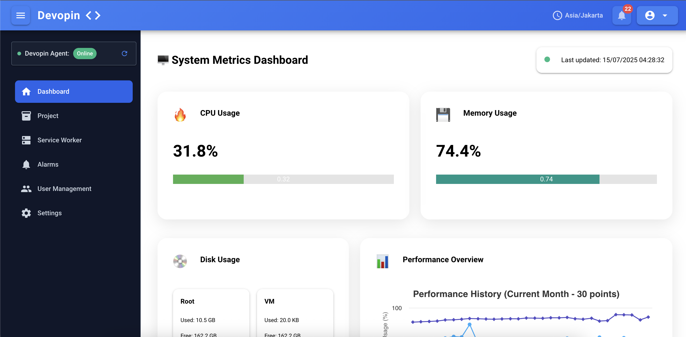
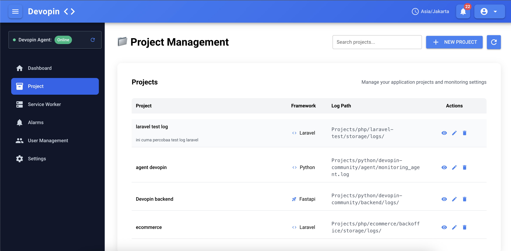
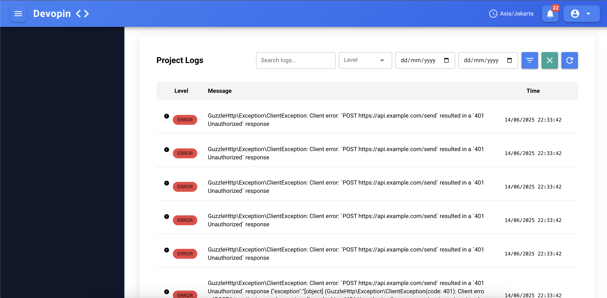
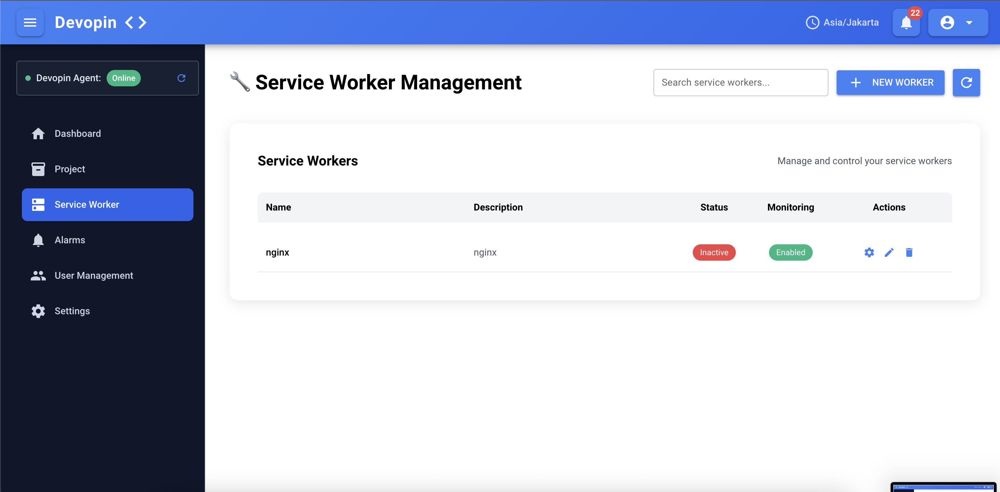
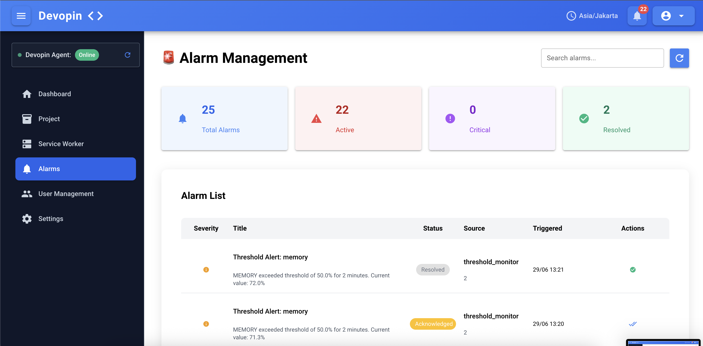
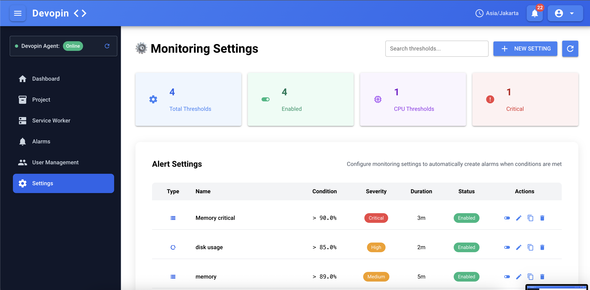
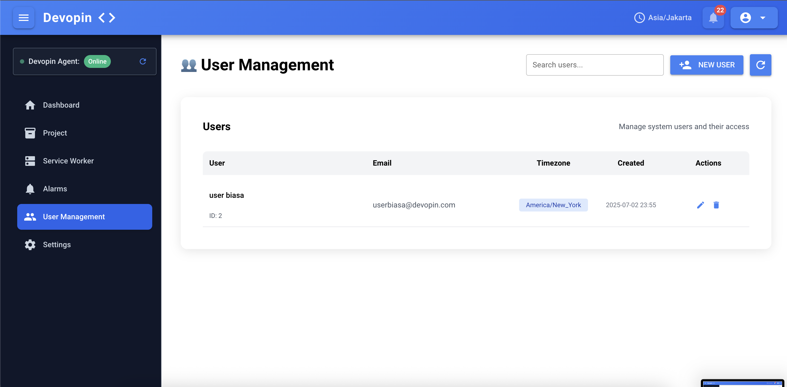

# Devopin App

A hybrid monitoring and management application that combines FastAPI REST API with NiceGUI web interface for comprehensive system monitoring and project management.

## 🚀 Features

- **Real-time System Monitoring** - Live CPU, memory, and disk usage tracking
- **Agent Communication** - Unix socket communication with external `devopin-agent`
- **Project Management** - Track and manage multiple projects with service workers
- **Alarm System** - Configurable thresholds and alerting
- **Web Dashboard** - Interactive web interface with real-time charts
- **User Authentication** - Secure login and registration system
- **Log Aggregation** - Centralized project log management

## 📸 Screenshots

### Dashboard Overview


### Project Management


### Project Detail & Log



### Service Worker


### Alarm


### Setting


### User Management



## 🚀 Quick Install

### One-Line Install (Recommended)
```bash
curl -sSL https://raw.githubusercontent.com/ddrag23/devopin/main/install.sh | sudo bash
```

### Docker Install
```bash
# Using Docker directly (quickest)
docker run -d --name devopin-app \
  -p 8080:8080 \
  -v $(pwd)/devopin-data:/app/data \
  -v /run/devopin-agent/:/run/ \
  akualwi/devopin-app:latest

# Or using Docker Compose
git clone https://github.com/ddrag23/devopin
cd devopin/backend
docker-compose up -d
```

### Quick Access
After installation, open `http://localhost:8080` in your browser to get started!

## 🏗️ Architecture

### Tech Stack
- **FastAPI** - Modern, fast web framework for REST API
- **NiceGUI** - Python-based web UI framework
- **SQLAlchemy** + **Alembic** - ORM and database migrations
- **SQLite** - Database storage
- **SocketIO** - Real-time communication
- **Unix Sockets** - Agent communication

### Project Structure
```
app/
├── api/route.py          # REST API endpoints (/api/*)
├── core/                 # Database config and logging
├── models/              # SQLAlchemy database models
├── schemas/             # Pydantic validation schemas  
├── services/            # Business logic and CRUD operations
├── ui/                  # NiceGUI web interface components
└── utils/agent_controller.py  # Unix socket communication
```

### Layered Architecture
- **API Layer** (`app/api/`) - REST endpoints for external monitoring data ingestion
- **UI Layer** (`app/ui/`) - NiceGUI-based web interface (auth, dashboard, project management)
- **Service Layer** (`app/services/`) - Business logic and database operations
- **Model Layer** (`app/models/`) - Database schema definitions

## 🛠️ Installation

### Docker Installation (Recommended for Production)

#### Using Docker Compose
```bash
# Clone the repository
git clone https://github.com/ddrag23/devopin.git
cd devopin/backend

# Start with Docker Compose
docker-compose up -d

# View logs
docker-compose logs -f

# Stop the service
docker-compose down
```

#### Using Docker CLI
```bash
# Pull and run the container
docker run -d --name devopin-app \
  -p 8080:8080 \
  -v $(pwd)/devopin-data:/app/data \
  -v /run/devopin-agent/:/run/ \
  akualwi/devopin-app:latest

# View logs
docker logs -f devopin-app

# Stop the container
docker stop devopin-app
docker rm devopin-app
```

#### Build Your Own Docker Image
```bash
# Clone and build
git clone https://github.com/ddrag23/devopin.git
cd devopin/backend
docker build -t devopin-app .

# Run your custom build
docker run -d \
  --name devopin-app \
  -p 8080:8080 \
  -v devopin-data:/app/data \
  --restart unless-stopped \
  devopin-app
```

### Automated Installation (Linux)

For most users, use the automated installer:

```bash
# Download and run installer
curl -sSL https://raw.githubusercontent.com/ddrag23/devopin/main/install.sh | sudo bash
```

This will automatically:
- Download the latest release
- Install system dependencies
- Create service user and systemd service
- Start the application
- Set up automatic startup

### Manual Installation

#### Prerequisites
- Linux system (Ubuntu, CentOS, RHEL, etc.) or Docker
- sudo/root access (for native installation)

#### Option 1: Download Release Binary
1. Download the latest release:
```bash
wget https://github.com/ddrag23/devopin/releases/latest/download/devopin-app-linux-amd64
chmod +x devopin-app-linux-amd64
sudo mv devopin-app-linux-amd64 /usr/local/bin/devopin-app
```

2. Run the application:
```bash
devopin-app
```

#### Option 2: Development Setup
1. Clone the repository:
```bash
git clone <repository-url>
cd backend
```

2. Install dependencies:
```bash
pip install -r requirements.txt
```

3. Set up environment variables:
```bash
cp .env.example .env
# Edit .env with your configuration
```

4. Initialize the database:
```bash
alembic upgrade head
```

## 🚀 Running the Application

### Docker (Recommended)
```bash
# Using Docker Compose
docker-compose up -d

# Check status
docker-compose ps

# View logs
docker-compose logs -f

# Restart
docker-compose restart

# Stop
docker-compose down
```

### Installed via Installer
If you used the automated installer, the service is already running:
```bash
# Check status
sudo systemctl status devopin-app

# View logs
sudo journalctl -u devopin-app -f

# Restart if needed
sudo systemctl restart devopin-app
```

### Manual Execution
```bash
# If installed to /usr/local/bin
devopin-app

# Or run directly
./devopin-app-linux-amd64
```

### Development Mode
```bash
python -m app.main
```

### Production Mode with Uvicorn
```bash
uvicorn app.main:app --reload
```

The application will be available at `http://localhost:8080`

## 🗑️ Uninstalling

### Docker Installation
```bash
# Stop and remove containers
docker-compose down

# Remove volumes (this will delete your data!)
docker-compose down -v

# Remove images
docker rmi $(docker images devopin-app -q)

# Clean up everything
docker system prune -f
```

### Native Installation
```bash
# If installed via installer
sudo /opt/devopin-app/uninstall.sh

# Or download and run uninstaller
curl -sSL https://raw.githubusercontent.com/ddrag23/devopin/main/uninstall.sh | sudo bash
```

## 🔧 Database Management

### Apply Migrations
```bash
alembic upgrade head
```

### Create New Migration
```bash
alembic revision --autogenerate -m "description"
```

### Database Models
- **User** - User authentication and management
- **Project** - Project information and configuration
- **ServiceWorker** - Service worker status and management
- **SystemMetric** - Real-time system monitoring data
- **ProjectLog** - Project-specific log entries
- **Alarm** - Alert configuration and history
- **Threshold** - Monitoring threshold settings

## 🔌 Agent Communication

The application communicates with an external [`devopin-agent`](https://github.com/ddrag23/devopin-agent) via Unix socket:

- **Production socket**: `/run/devopin-agent.sock`
- **Development socket**: `/tmp/devopin-agent.sock`
- **Auto-fallback**: Automatically switches between production and development paths

Socket communication is handled by `app/utils/agent_controller.py:15` - AgentController class.

## 📊 API Endpoints

### Monitoring Data Ingestion
- `POST /api/monitoring-data` - Ingest real-time monitoring data
- Additional endpoints available in `app/api/route.py`

### Web Interface Routes
- `/` - Redirects to login
- `/login` - User authentication
- `/register` - User registration
- `/dashboard` - Main monitoring dashboard
- `/projects` - Project management
- `/alarms` - Alarm configuration
- `/thresholds` - Monitoring thresholds

## 🎨 Web Interface

The web interface features:
- **Responsive Design** with glassmorphism styling
- **Real-time Dashboard** with live performance charts
- **User Authentication System**
- **Project and Service Worker Management**
- **Interactive Monitoring Visualizations**

## 📁 Configuration

### Environment Variables
Create a `.env` file based on `.env.example`:
```env
DATABASE_URL=sqlite:///./devopin.db
```

### Database Configuration
Database settings are configured in `alembic.ini:87` - SQLAlchemy URL configuration.

## 📝 Logging

The application uses structured logging with different log levels:
- Application logs: `logs/app_YYYYMMDD.log`
- Debug logs: `logs/debug_YYYYMMDD.log`
- Error logs: `logs/error_YYYYMMDD.log`

Logging configuration is handled in `app/core/logging_config.py`.

## 🔍 Key Components

### Main Application Entry Point
`app/main.py:17` - Main application startup with NiceGUI server configuration

### Socket Communication
`app/utils/agent_controller.py:15` - AgentController class for Unix socket communication

### Database Configuration
`app/core/database.py` - Database connection and session management

### API Routes
`app/api/route.py` - All REST API endpoints for external integrations

## 🧪 Development

### Project Layout
- **Models** (`app/models/`) - Database schema definitions
- **Schemas** (`app/schemas/`) - Pydantic models for API validation
- **Services** (`app/services/`) - Business logic layer
- **UI Components** (`app/ui/`) - NiceGUI interface components

### Adding New Features
1. Define database models in `app/models/`
2. Create Pydantic schemas in `app/schemas/`
3. Implement business logic in `app/services/`
4. Add API endpoints in `app/api/route.py`
5. Create UI components in `app/ui/`
6. Generate and apply database migrations

## 🤝 Contributing

1. Fork the repository
2. Create a feature branch
3. Make your changes
4. Add tests if applicable
5. Submit a pull request

## 📄 License

[Add your license information here]

## 🏗️ Building and Releasing

### Build Release Package
```bash
# Build for all platforms
./build-release.sh

# Build with specific version
./build-release.sh v1.0.0
```

This creates:
- Executables for Linux (x64, ARM64)
- Installation scripts
- Release package with checksums

### Publishing Release
1. Run build script
2. Upload files to GitHub releases
3. Update installer URLs
4. Test on clean systems

## 🆘 Support

For support and questions, please [create an issue](link-to-issues) in the repository.

## 📋 Quick Start

1. **Install**: `curl -sSL https://your-domain.com/install.sh | sudo bash`
2. **Access**: Open `http://localhost:8080` in your browser
3. **Register**: Create your first user account
4. **Configure**: Set up monitoring and alerts
5. **Monitor**: View real-time system metrics